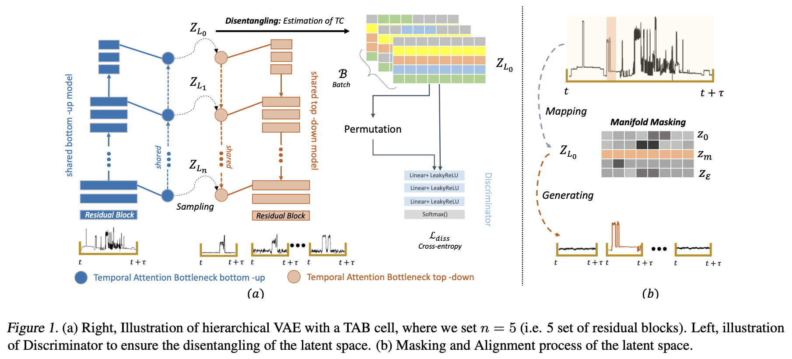
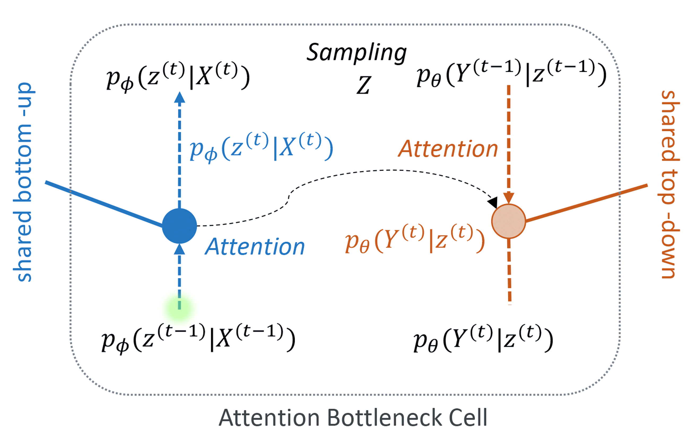
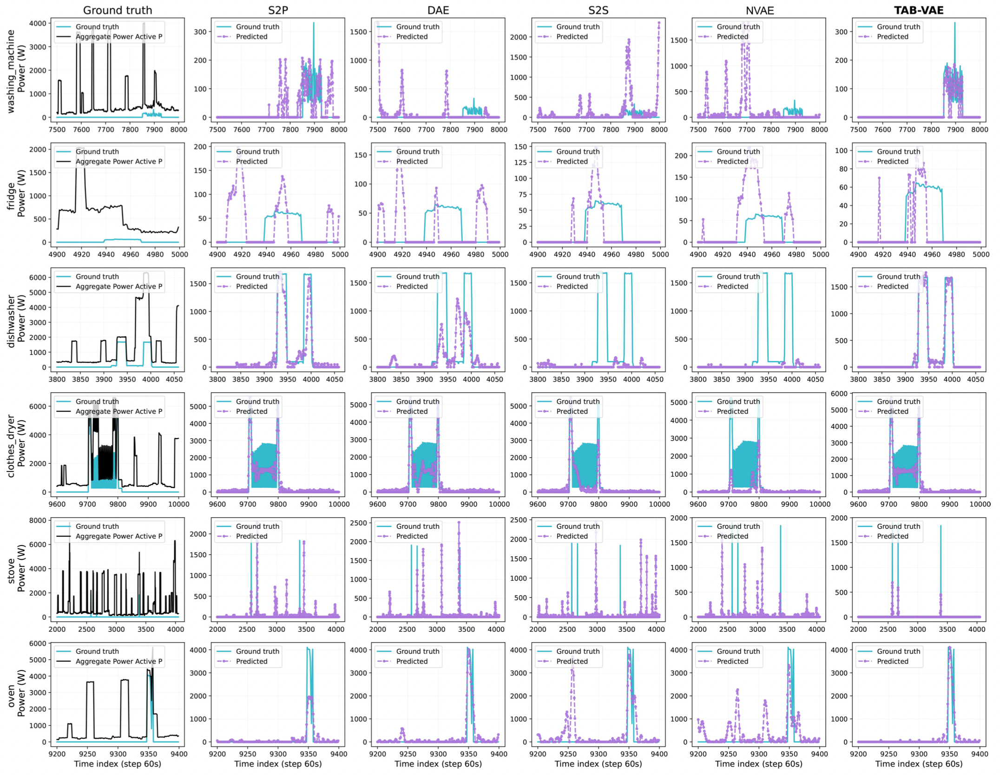

*Note
We updated the code to make it more clear 
*
# TAB-VAE: Temporal Attention Bottleneck for VAE is informative? 

ICML 2023 Workshop on DeployGenerativeModel: Temporal Attention Bottleneck for VAE is informative? 

The use of generative models in energy disaggregation has attracted attention to address the challenge of source separation. This approach holds promise for promoting energy conservation by enabling homeowners to obtain detailed information on their energy consumption solely through the analysis of aggregated load curves. Nevertheless, the model's ability to generalize and its interpretability remain two major challenges. To tackle these challenges, we deploy a generative model called TAB-VAE (Temporal Attention Bottleneck for Variational Autoencoder), based on hierarchical architecture, addresses signature variability, and provides a robust, interpretable separation through the design of its informative representation of latent space.



| Dataset Test | Method | Metric | Fridge | Washing.M | Oven |
|--------------|--------|--------|--------|-----------|------|
| UK-DALE      | DAE    | F1 ($\uparrow$) | 80.57  | 81.37     | 81.80|
|              | S2S    |          | 83.99  | 86.08     | 83.61|
|              | S2P    |          | 83.73  | 86.12     | 83.63|
|              | NVAE   |          | 90.10  | 87.32     | 81.13|
|              | TAB-VAE|          | **91.81** | **93.26** | **93.77**|
|--------------|--------| MSE ($\downarrow$) | 25.74 | 25.63 | 25.46|
|              | S2S    |          | 26.70 | 24.72 | 23.98|
|              | S2P    |          | 27.36 | 28.92 | 25.28|
|              | NVAE   |          | 28.36 | 21.12 | 22.18|
|              | TAB-VAE|          | **19.55** | **18.33** | **19.30**|
|--------------|--------|--------|--------|-----------|------|
| REDD         | DAE    | F1 ($\uparrow$) | 82.99  | 81.94     | 81.90|
|              | S2S    |          | 87.09  | 86.16     | 83.78|
|              | S2P    |          | 86.96  | 85.57     | 84.14|
|              | NVAE   |          | 93.23  | 91.54     | 91.30|
|              | TAB-VAE|          | **94.25** | **93.07** | **94.04**|
|--------------|--------| MSE ($\downarrow$) | 26.56 | 25.34 | 25.42|
|              | S2S    |          | 26.56 | 24.78 | 23.94|
|              | S2P    |          | 30.68 | 28.40 | 25.04|
|              | NVAE   |          | 21.18 | 23.22 | 20.78|
|              | TAB-VAE|          | **19.48** | **18.33** | **19.55**|


## Temporal Attention Bottleneck Cell

<p align="center">

</p>

### Disentangeled Representation

Using a Batch Estimate of $q(z)$ for Estimating TC, we have also tried using a batch estimate for the density $q(z)$, thus optimizing this estimate of the Total Correlation (TC) directly instead of having a discriminator and using the density ratio trick. In other words, we tried $p_{\phi}(z) \approx \hat{p_{\phi}}(z) = \frac{1}{|B|} \sum_{i \in B} p_{\phi}(z|x^{(i)})$, and using the estimate:

```math
\mathrm{KL}(p_{\phi}(z) || \prod_{j}{p_{\phi}}(z_{j})) = E_{q(z)} \left[ \log \frac{p_{\phi}(z)}{\prod_j p_{\phi}(z_j)} \right]\ \\ \approx E_{q(z)} \left[ \log \frac{\hat{p}_{\phi}(z)}{\prod_j \hat{p}_{\phi}(z_j)} \right]\ \\ \approx E_{q(z)} \left[ \log \frac{D(z)}{1-D(z)} \right]
```
where $D$ is a discriminant model with learning parameter $\psi$ (Optimised using $\mathcal{L}_{\text{CrossEntropy}}$).

### Ordering and Alignment by Masking

Our inspiration is derived from information theory, specifically proposition.\ref{prop:theory_information}, which provides valuable insight. When the information of $\mathbf{X}^{(t)}$ is concealed, it exists within the latent space $z^{(t)}$ as well as in $\mathbf{Y}^{(t)}$. Leveraging this understanding, we have devised a method to instruct our model to utilize this property for the purpose of masking and aligning the latent space with a specific device.

1. Insight from Information Theory:

Assuming $\mathbf{X}^{(t)}$, $z$, and $\mathbf{Y}^{(t)}$ form a Markov chain, $\mathbf{X}^{(t)} \rightarrow z^{(t)} \rightarrow \mathbf{Y}^{(t)}$, where $p(\mathbf{Y}^{(t)}|\mathbf{X}^{(t)}, z^{(t)}) = p(\mathbf{Y}^{(t)}|z^{(t)})$, the data processing inequality ensures that $I(\mathbf{X}^{(t)};z) \geq I(\mathbf{X}^{(t)};\mathbf{Y}^{(t)})$. If $z^{(t)}$ is a deterministic or stochastic function of $\mathbf{X}^{(t)}$, it cannot contain more information about $\mathbf{Y}^{(t)}$ than $\mathbf{X}^{(t)}$ itself.

## Run Experiment

In order to execute the experiment run:

- Install requirements 

```
pip install -r requirements.txt
```

```python
python run_exp.py --root_path /TAB-VAR --data_path /dataset/Uk-dale --input_dim 3 --beta_end 0.1
```

## Datasets
The **NILMTK**[2] toolkit is used for reading the data.
All the datasets that are compatible with **NILMTK** are supported, but the benchmark
is constructed on end-uses from **UK DALE**[3], **REDD**[4] and **REFIT**[5]. 
It should be noted that the data have to be downloaded manually. You can use Xgentime for energy to load data remotely.

## Resultats




## References
1. Batra, N.; Kelly, J.; Parson, O.; Dutta, H.; Knottenbelt, W.; Rogers, A.; Singh, A.; Srivastava, M. NILMTK: an open source toolkit 525 for non-intrusive load monitoring. Proceedings of the 5th international conference on Future energy systems, 2014, pp. 265–276.

2. Symeonidis, N.; Nalmpantis, C.; Vrakas, D. A Benchmark Framework to Evaluate Energy Disaggregation Solutions. International 541
Conference on Engineering Applications of Neural Networks. Springer, 2019, pp. 19–30.

3. Jack, K.; William, K. The UK-DALE dataset domestic appliance-level electricity demand and whole-house demand from five UK
homes. Sci. Data 2015, 2, 150007.

4. Kolter, J.Z.; Johnson, M.J. REDD: A public data set for energy disaggregation research. Workshop on data mining applications in
sustainability (SIGKDD), San Diego, CA, 2011, Vol. 25, pp. 59–62.

5. Firth, S.; Kane, T.; Dimitriou, V.; Hassan, T.; Fouchal, F.; Coleman, M.; Webb, L. REFIT Smart Home dataset, 2017.
doi:10.17028/rd.lboro.2070091.v1.

## Licence

This project is licensed under the MIT License - see the [LICENSE](LICENSE) file for details

